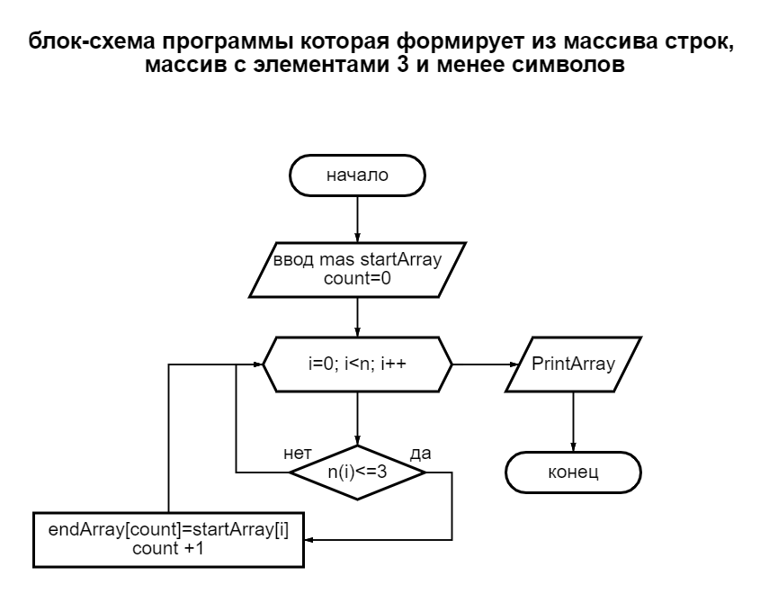

# Задача :
---
> Написать программу, которая из имеющегося массива строк формирует массив из строк, длина которых меньше либо равна 3 символа.   Первоначальный массив можно ввести с клавиатуры, либо задать на старте выполнения алгоритма. При решении не рекомендуется пользоваться коллекциями, лучше обойтись исключительно массивами.
Описание алгоритма решения:
1.	Создаем массив строк из введенных элементов с клавиатуры.
2.	Создаем метод, где с помощью цикла «For» проверяем все элементы массива на условие <=3 символа, если соответствует условию, то элемент массива заносится в счетчик «count» для последующего вывода в итоговый массив, иначе переходим к следующему элементу для проверки условия.
3.	После завершения проверки всех элементов массива на соответствие условию <=3, создаем метод вывода итогового массива на консоль.
---

---

__Программа решения задачи: DZitog3/DZitograbota3/Program.cs__
---